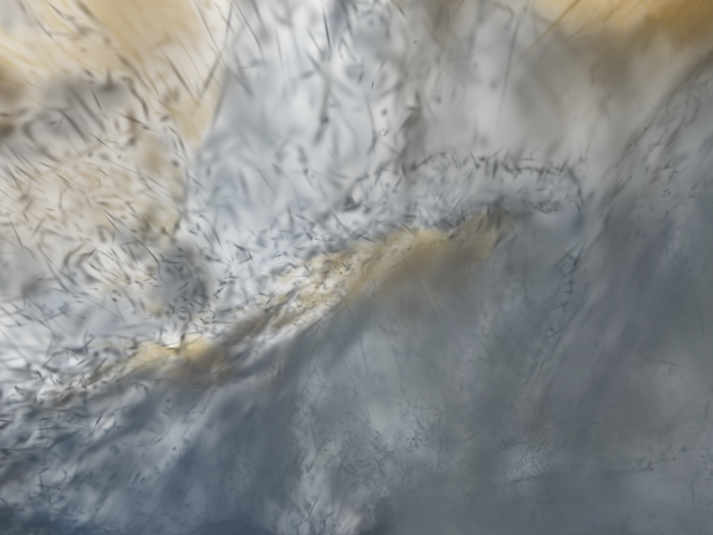

# splatcom



Single-client gaussian splat rendering process designed to provide simulated camera data for simulation use.

## Client Setup

Create a python virtual environment using the following:

```bash
python -m venv .env
source .env/bin/activate
```

Install the test client package with the following:

```bash
pip install -e ./basic_client
```

## Usage

Simply call the splatcom executable with the relative filepath of the .ply file you need to render. E.g.

```bash
cargo r -- data/construction_site.ply
```

which will start the server. A basic `client.py' has been provided to allow for testing, which will generate a series of images in a sphere around a given point that will point at the center of the model.

The server is also launchable through Docker using the following commands:

```bash
docker build -t splatcom . 
docker run --rm -v "$(pwd)/data:/data:ro" -p 127.0.0.1:8080:8080 splatcom /data/construction_site.ply
```

Assuming your model is located in the `data/` directory. 

NOTE: The containerization is untested. This server was developed on macOS, and there is no compatibility layer for calls to the M4 GPU from a Linux image. It should work on any other hardware, but *is* untested. 

## Dependencies

Below is a list of dependencies and the reasons they are included:

* `brush-render` | Rendering crate from `brush`
* `brush-render` | IO crate from `brush`
* `serde-json` | JSON parser
* `interprocess` | Flexible handling for IPC, explained below
* `log/env_logger/pretty_env_logger` | crate for handling logging statements
* `glam` | Vector graphics library used by `brush`
* `anyhow` | multipurpose error handling crate
* `tokio` | Asynchronous rust, used for both async threads and networking

# General Program Structure

`splatcom` uses two main threads: one handles network I/O, and the other is the primary rendering loop.

The network thread starts a TCP listener and awaits incoming image request packets. The packets are deserialized using `serde-json`, and pushed to an image request buffer as they are received. Each incoming packet uses its own `tokio` thread, which prevents blockage while creating minimal overhead. Each job is sent with a `tokio` oneshot reply channel (essentially a consumable `mpsc` thread transmission channel) which returns the `ImageResponse` with render metrics and the delivered file location. The resultant packet is then transmitted back on the same listener thread.

The primary render loop uses `brush` as a rendering backend. Splats are loaded with `brush`'s gaussain splat backend, and stored in VRAM. Camera position, rotation, and other characteristics such as FOV are transmitted with the image request, and used in the primary render call. When the image is rendered, the resultant tensor is processed from floats into RGBA, saved to file, and the metrics are returned to the I/O thread.


# Design Decisions

This section contains a brief summary of design decisions.

## IPC Choices and Usage

~~I've decided on using the interprocess crate for IPC. I'm developing this on macOS, and locally this will yield a local socket, which behaves like a websocket but without using the network layer. Should enable sharing between processes on the same computer. Assuming that this may be transitioned to a network-based solution in future, this could be easily swapped out with a websocket if the need arises.~~


A shared memory IPC is generally not possible with a Docker image, as it does not share the kernal of main computer, and therefore not with the client. `splatcom` previously used `interprocess` for IPC, but has been swapped out for `tokio`-based TCP communication. Server now communicates over TCP on `127.0.0.1:8080`, and is configured to work whether on Docker or built locally.

## Message Passing

I have chosen to utilize JSON for the time being. Protobuf is a better choice for performance, but I'm currently more familiar with JSON and the `serde-json` library, and will use that at the start of the development cycle. Switching between JSON and Protobuf would be relatively simple in future, but would cause breaking changes (assuming we're not going to have both message passing systems be backwards compatible).

## Supported Camera Models

Camera properties are configurable on a per-request basis. Pinhole properties (specifically center of pinhole relative to the image) is configurable via request packet, as is image size and camera x/y FOV. This allows for a dynamic FOV to model a non-static camera focal length. As such, any type of camera can be supported. The client sends requests with a default FOV ratio of `1.5` (3:2, 90 deg X, 60 deg Y) and a pinhole center at `(0.5, 0.5)` (image center).

## Choice of Rasterizer

The `brush` backend was chosen as the image rasterizer. `gsplat` would have been the optimal choice, as it is built as a rasterization **library** wheras `brush` was built as a gaussian splat **viewer** with a custom backend. However, `gsplat` was written exclusively for CUDA-compatible hardware (Nvidia exclusive) and as such is incompatible with the Apple `metal` backend that I am developing for. 

As `brush` is a standalone package, it has no pinnable version on `crates.io`. It is dependent on an unpinned version of `burn`, an ML backend, which is also not pinnable on `crates.io`. As such, both are pinned to a specific commit on each of the respective repos that were found to be mutually compatible and stable.

## Possible Expansion and Multiple Drones

The process is currently able to handle a large number of calls from a single client, but should currently be capable of handling a larger number of incoming clients on the same TCP port. The primary bottleneck is the render call, which could be multithreaded to imrpove performance. The GPU can only process one image at a time, but preprocessing, post-processing and file writes can be parallelized without issue. 

The process would go something like this: Each job spawns a new `tokio` thread to allow parallelization of render calls. Only one image can be rendered at a time, but each render call involves some preprocessing (camera setup, timing, etc) which can be parallelized. The primary bottleneck in this case is the actual render call to the GPU, which is an asynchronous function. As such, each `splatcom` render thread can run until the `brush` backend render call is needed, and then `await` GPU availability. 

Some experimentation revealed that the `brush` backend uses a global `Mutex` to serialize all render calls, and locks up on a multithreaded implementation like the one above. The solution would be to swap out the renderer for `gsplat` or a custom implementation of `brush` to fix this issue.

### Depth Mapping

If this were implemented with a custom backend, a seperate map of splat minimum z-distance (away from screen) per-pixel could be returned on top of the existing image rasterization which would provide a depth map and allow simulation of a depth-camera. I may expand this project in future with a custom rasterization loop which would allow an easier return of those values, but for the existing rasterizer would require some modification.

### Video Streaming

Assuming that there is sufficient hardware to render video at a given rate (say, 60 FPS), a video streaming codec could be used in place of the metrics response packet that is currently being sent. It would require the following modifications to the program:

* Queue replaced with a priority queue, so that images are processed according to their ID order instead of the order in which they arrived
* Reply package replaced with an image streaming format such as AVC (https://en.wikipedia.org/wiki/Advanced_Video_Coding)
* Client interface using the RTSP format


# AI Usage

* Dependency management for `brush-render`/`brush-serde`/`burn` package management. Brush subcrates depend on burn, but neither burn nor brush locks versions relative to each other. As of 15 MAY 2026, both projects have been updated multiple times today. Used Claude Code to lock down dependencies for each package relative to each other, which saved a large chunk of time without actually contributing to the design process.
* Documentation for `brush` backend, which contains little to no comments or documentation (e.g. camera FOV is in radians, not degrees)
* Some minor debugging code not used in the final build (e.g. generate a list of points and save off images at each point) as a time saving measure
* A method to interpret ctrl-c for Tokio threads (shutdown flag and message passing was not AI)
* Sender file functions to generate a sphere of points and send them over the TCP port. Something I can do but more of a time saving thing.
* Docker tutorial